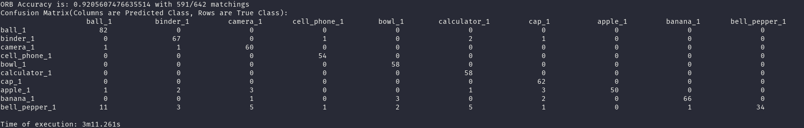

## Object Recognition with Feature Detection

10 objects(apple_1, ball_1, banana_1, bell_pepper_1, binder_1, bowl_1, calculator_1, camera_1, cap_1, cell_phone_1) from [this link](google.com) is chosen for both training and detection.

### Example Training Results:

### Object Recognition Algorithms:

All of the algorithms take in 2 parameters. A training data set and a test data set. Test data set is chosen as the random 10% of all the data and the training data set is the 90% left. The match referred as KNN match is Brute Force Matcher KNN Match. All of the algorithms below follow the general routine which is:

1. Find keypoints and create descriptors from the given training data set using a feature detector and descriptor.
2. For every image in the test data set:
3. Find keypoints and create descriptors using the feature detector and descriptor used in training
4. Match the found descriptors with training descriptors using a matcher. Find the max number of matches for each object class.
5. Select the object class with the biggest max number of matches as the classification for the test object.

The algorithms are as follows:

1. SIFT only: SIFT descriptors with SIFT keypoints and KNN match
2. ORB only: ORB descriptors with ORB keypoints with brute force match
3. ORB with KNN Matching
4. FAST with SIFT Descriptors: SIFT descriptor with FAST keypoints and KNN match

### Results:

1. SIFT

2. ORB with Edge Threshold=12

3. ORB with Edge Threshold=10

4. ORB+KNN matching with Edge Threshold=12

5. ORB+KNN matching with Edge Threshold=10

6. FAST

### Accuracies:

1. SIFT: 622/642
2. ORB with Edge Threshold=12: 552/642
3. ORB with Edge Threshold=10: 591/642
4. ORB+KNN matching with Edge Threshold=12: 623/642
5. ORB+KNN matching with Edge Threshold=10: 629/642
6. FAST: 642/642
